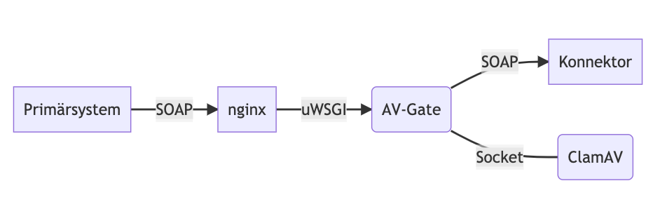
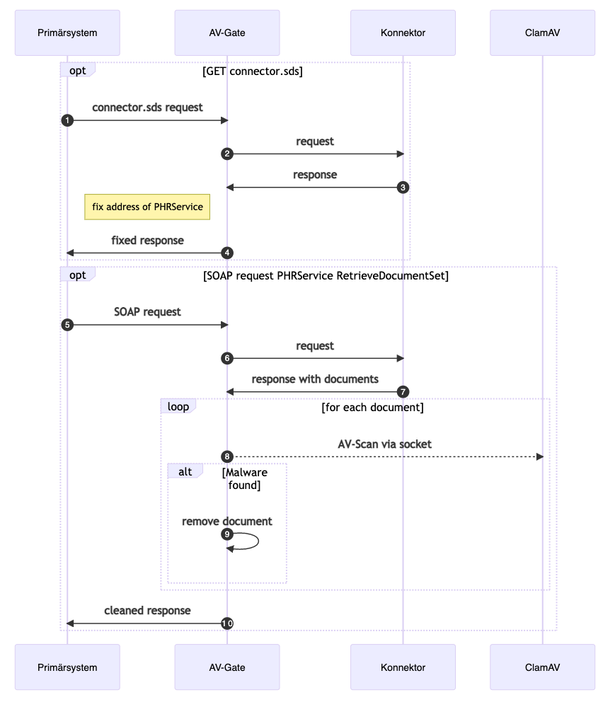

# AV-Gate

Proxy für den Antivirus-Scan von Dokumenten zu der elektronischen Patientenakte (ePa). Dieser Proxy wird zwischen dem Konnektor der Gematik und den Primärsystemen geschaltet und überprüft sämtliche Dokumente der ePA vor der Übertragung an die Primärsysteme.

Bei einem Fund von Malware wird das Dokument aus der Übertragung herausgenommen. Stattdessen wird eine Fehlermeldung für das entsprechende Dokument an das Primärsystem übergeben. Veränderungen an dem Repository der ePA selbst werden nicht vorgenommen.

Alternativ kann das Dokument bei Fund von Maleware durch eine Datei gleichen Types (Mime-Type) ersetzt werden. In diesem Fall wird der Payload des Soap-Responses nicht verändert. Dies ist notwendig, wenn das Primärsystem die Fehlermeldungen nicht verarbeiten kann. Die Ersatz-Dokumente liegen in dem Unterverzeichnis `replacements` und enthalten jweils den Hinweis:

> Das Dokument wurde ersetzt, weil beim originären Dokument potentiell schadhafter Code entdeckt wurde.
Das Original wird nicht ausgeliefert.

Für den AV-Scan wird ICAP als Schnittstelle genutzt. Alternativ kann die open-source Lösung [ClamAV](https://www.clamav.net/) genutzt. Es erkennt schadhaften Code auch in Anhängen zu PDF, Excel und Word und OpenOffice Dokumenten. Testdateien mit der harmlosen [EICAR](https://www.eicar.org/?page_id=3950) Test-Signatur befinden sich für alle Mime-Typen im Verzeichnis `testfiles`. Nachdem Virenscanner regelmäßig auch bei den EICAR Testfiles aufschreien, wurden die Testfiles und Samples in einem zip-File abgelegt (password ist password).

## Architektur und Funktionsweise



Das AV-Gate fungiert als Proxy zwischen Primärsystem und Konnektor. Die Verbindungen zwischen Primärsystem und NGINX sowie zwischen AV-Gate und Konnektor sind TLS gesichert. Die Requests an den Konnektor sind technisch komplett getrennt von den Requests an das AV-Gate (bzw. dem NGINX).

Die Autorisierung für den Konnektor wird bei Basic-Auth aus dem ursprünglichen Request übernommen. Client-Zertifikate müssen je Konnektor für das AV-Gate gesondert konfiguriert werden; eine Übername aus dem Request ist hier nicht möglich.

Die Verbindung zum ClamAV Dienst erfolgt über unix Socket. Daher muss der clamd auf der gleichen Maschine installiert sein.



Die Trennung zwischen NGINX und AV-Gate wurde aus Gründen der Übersichtlichkeit weggelassen.

1: Request der connector.sds
Die connector.sds ist ein Verzeichnis der Service-Adressen.

2: Request an den Konnektor
Hier wird ein neuer Request erzeugt (kein Forward oder Proxy). Der Request aus 1 wird gehalten.

4: Die Adresse für PHRService, welche den Endpunkt RetrieveDocumentSet enthält wird durch die Adresse des AV-Gates ersetzt. Diese wird aus dem Request an das AV-Gate ermittelt.

7: Response vom Konnektor
Der Response beinhaltet neben SOAP-Response auch die Dokumente als [XOP](https://de.wikipedia.org/wiki/XML-binary_Optimized_Packaging).

Responses zu anderen Endpunkten als RetrieveDocumentSet werden direkt an das Primärsystem weitergegeben.

8: AV-Scan
Die aus dem Response extrahierten Dokumente werden via socket stream an den clamd übergeben. Die Dateien werden nicht im Filesystem gespeichert. Die Latenz durch den Scan ist sehr gering (<100ms).

9: Remove Document
Der XOP Teil der Nachricht für die betroffenen Dokumente wird entfernt und eine Fehlermeldung wird in den SOAP-Response geschrieben.
Alternativ wird hier das Dokument ersetzt und der SOAP-Response ansonst nicht verändert.

Der Ersatz der schadhaften Dokumente erfolgt mit den jeweiligen Dateien aus dem Verzeichnis `replacements'. Es sind für folgende Dateitypen/Mime-Typen Dokumente vorhanden:

- application/pdf
- image/jpeg
- image/png
- image/tiff
- text/plain
- text/rtf
- application/xml
- application/hl7-v3
- application/pkcs7-mime
- application/fhir+xml

### Office Dokumente

- application/vnd.openxmlformats-officedocument.wordprocessingml.document (.docx)
- application/vnd.openxmlformats-officedocument.spreadsheetml.sheet (.xlsx)
- application/vnd.oasis.opendocument.text (.odt)
- application/vnd.oasis.opendocument.spreadsheet (.ods)

Die Office-Dokumente sind in der aktuellen Version von ePA nicht mehr zugelassen, dennoch werden diese hier noch berücksichtigt, weil bestehende Dokumente unverändert ausgeliefert werden.

## ClamAV

Der Virenscanner läuft als Daemon. Die Aktualisierung der Viren-Signaturen erfolgt über einen eigenen Dienst.

- [Installation](https://docs.clamav.net/manual/Installing.html)
- [SignatureManagement](https://docs.clamav.net/manual/Usage/SignatureManagement.html)

## Installation

Es werden benötigt:

- Python 3.10
- uWSGI 2.0.21
- NGINX 1.25.3
- ClamAV (optional)

Bislang wurde als Host-System Ubuntu Server 22.04.3 LTS verwendet. Die oben genanten Versionen entsprechen dieser Konfiguration.

1. ClamAV (nur, wenn nicht ICAP verwendet wird)
/etc/clamav/clamd.conf
`LocalSocket /tmp/clamd.socket`

2. Signaturen laden
/etc/clamav/freshclam.conf
`sh> freshclam`

3. NGINX
Eine vollständig Beispielkonfiguration `nginx.conf` liegt bei. Ports, SSL-Zertifikate und ggf. Socket müssen angepasst werden. Angaben der Ports als Range sind seit NGINX 1.15.10 möglich.

4. uWSGI
Beispieldatei `uwsgi.ini` liegt bei. Socket und chdir müssen angepasst werden. Virtualenv kann weggelassen werden, wenn auf dem Server keine weiteren, anderen Python-Versionen benötigt werden.

5. AV-Gate
Dateien avgate.py, avgate.ini, requirements.txt in ein Programmverzeichnis kopieren (z.B. /usr/local/avgate/).
`sh> pip3 install -r requirements.txt`
Der Pfad für den Socket in `avgate.ini` ist ggf. anzupassen.

## Konfiguration ohne Docker

In der `avgate.ini` ist für jeden Konnektor eine Gruppe anzulegen. Der Gruppenname beschreibt das Routing über IP-Adresse mit Port `[<ip-address>:<port]` - oder aber ausschließlich über den Port `[*:<port>]`. Gruppen mit IP-Adresse werden vor den Gruppen ohne IP-Adressen berücksichtigt.

> Auf die Verwendung von Namen statt IP-Adressen wurde verzichtet, weil ein Großteil der Primärsysteme keine Namen in der Konfiguration verwenden kann.

Für jede Konnektor (jede Gruppe) kann konfiguriert werden:
- konnektor = https://<host>
- ssl_verify = true
Die Zertifikate des Konnektors werden auf Gültigkeit überprüft. Verbindungen mit ungültigen (auch selfsigned) Zertifikaten werden abgelehnt.
- ssl_cert = <pfad.crt>
- ssl_key = <pfad.key>
Client-Zertifikat für Autorisierung gegenüber Konnektor. Die Zertifikate können als als .crt oder .pem hinterlegt werden und dürfen nicht verschlüsselt sein.

Auf jeden Arbeitsplatzrechner muss in der Konfiguration der Primärsysteme die IP-Adresse des AV-Gates als Konnektor eingetragen werden.

> **Warnung:** Wird auf einem Arbeitsplatzrechner der Konnektor nicht angepasst, erfolgt kein AV-Scan der Dokumente! Das Primärsystem wird aber dennoch wie bisher auch funktionieren - dies lässt sich technisch auch nicht verhindern.

Das Logging des AV-Gates erfolgt über uWSGI.

## mTLS für AV-Gate

Für die Autorisierung gegenüber dem AV-Gate kann - analog zum Konnektor - mTLS genutzt werden.
In der nginx.conf innerhalb von 'server':

- ssl_client_certificate <pfad ca-cert>
- ssl_verify_client on

## Konfiguration Docker

Der Betrieb des AV-Gate zusammen mit nginx in einem Container bietet sich an, wenn ein einzelner Konnektor angesprochen werden soll.

Zum bauen:

`docker build -t avgate .`

Zertifikate:

Die benötigten Zertifikate sind am einfachsten per mount einzubringen. Folgende Zertifikate dazu ins Unterverzeichnis `cert` ablegen:

- kclient.cert & kclient.key - Client-Zertifikate (mTLS) für die Authorisierung gegenüber dem Konnektor
- server.cert & server.key - TLS Zertifikate für https Verbindung
- ca-cert.pem - CA Zertifikat für die Prüfung der Client-Zertifikate

Zum Starten:

```sh
docker run --name avgate -p 443:443 -p 389:389 -p  \
-e ICAP_HOST=<av_server> \
-e ICAP_SERVICE=<icap://av_server/service> \
-e KONNEKTOR=https://<konnektor> \
-e SSL_VERIFY=off \
--mount type=bind,source="$(pwd)"/cert,target=/app/cert,readonly \
avgate
```

Bitte beim Mount der Zertifikate darauf achten, dass Leseberechtigung bestehen.

Die ENV vars:

- KONNEKTOR
  URI des Konnektors

- ICAP_HOST - default ist host.containers.internal
  Hostname ohne Port des ICAP Servers

- ICAP_SERVICE - default ist icap://any/avscan
  ICAP Service als URI. Der Service musss im ICAP Server konfiguriert sein.

- SSL_VERIFY - default ist on
  Überprüfung des Server-Zertifikats vom Konnektor

- SSL_VERIFY_CLIENT - default ist on
  Überprüfung der Client-Zertifikate

- LOG_LEVEL - default INFO
  einer aus DEBUG INFO WARNING ERROR CRITICAL


## Primärsysteme

Das AV-Gate wurde für folgende Primärsysteme getestet:

| Primärsystem | Version | Status | Anmerkung |
|---|---|---|---|
| Dedalus - Orbis | | voll funktionsfähig | `proxy_all_services` muss gesetzt sein |
| medatixx - x.concept | | voll funktionsfähig |  |
| KIS - iMedOne | | voll funktionsfähig | `proxy_all_services` muss gesetzt sein |

--

Consol GmbH
Norbert Ferchen
Jan 2024
