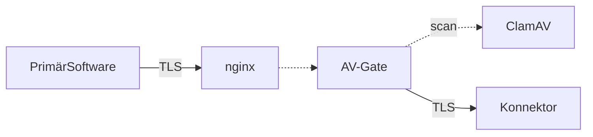

# AV-Proxy

Proxy für den Gematik Konnektor zum AV-Scan von herungergeladener Dokumente.

- [SOAP Schnittstelle](docs/soap.md)
- [Infrastruktur](docs/infrastruktur.md)
- [Tasks & offene Fragen](docs/tasks.md)

## Installation

### ClamAV

`clamd` soll als Deamon laufen und die DB initialisiert sein.

Folgende Einstellung werden benötigt:
```
LocalSocket /tmp/clamd.socket
```

Der Pfad für den Socket ist in `av_gate.py` anzupassen.

### Python

Die benötigte Version ist 3.8. oder später

Folgende Dateien werden benötigt:
```
av_gate.py
requirements.txt
wsgi.py
cert/*
```

Installation der benötigten Libs mit

`pip3 install -r requirements.txt` - oder mit `pip`, wenn pip3 nicht verfügbar.

Innerhalb der av_gate.py sind die Konfigurationen anzupassen
```
CLAMD_SOCKET = "/tmp/clamd.socket"
UPSTREAM_SERVER = "https://kon-instanz1.titus.ti-dienste.de" # "https://127.0.0.1:5000"
PROXY_SSL_CERT = "cert/ps_epa_consol_01.crt"
PROXY_SSL_KEY = "cert/ps_epa_consol_01.key"
SSL_VERIFY = True
```

### uWSGI

Hab ich noch nicht für Ubuntu gemacht, daher hier der Verweis:

https://uwsgi-docs.readthedocs.io/en/latest/Install.html

### NGINX

Ein Muster für die config-Datei liegt bei. Die URLs, Ports und Zertifikate sind noch anzupassen.

Aktuell fungiert NGINX ausschließlich als Proxy für die Verbindungen vom Client (Primäranwendung) zum AV-Gate. Die Verbindung zum Konnektor erfolgt bis jetzt ausschließlich durch das AV-Gate.

## Architektur

Für die Primärsoftware wird als Konnektor der nginx-Server mit AV-Gate konfiguriert.

nginx terminiert TLS und richt die Anfrage an das AV-Gate weiter.

AV-Gate ermittelt den passenden Konnektur über eine .ini-Datei und reicht die Anfrage weiter.

AV-Gate ersetzt den Endpunkt im Response zu connector.sls für `PHRService`, zu dem der Aufruf `RetrieveDocumentSetRequest`gehört.

AV-Gate enpackt die Dokumente aus der Response zu `RetrieveDocumentSetRequest` und scannt die einzelnen Dokumente via ClamAV über eine Socket-Verbindung. Wird ein Virus gefunden, wir die Nachricht durch einen Hinweistext ersetzt.



AV-Gate kennt keine Schemata und sollte auch mit künftigen Versionen der Gematik ePA Api funktionieren. Vorausgesetzt `connector.sls` und `RetrieveDocuemntSetRequests` werden genutzt.

--

Consol GmbH

Norbert Ferchen

Oktober 2021